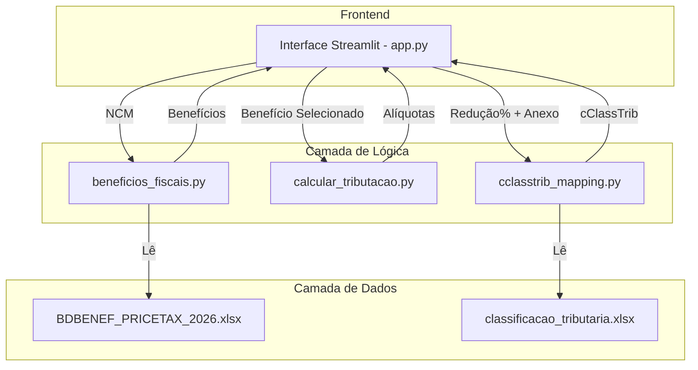

# 🏛️ Arquitetura do Sistema IBS/CBS

**Autor:** Manus AI
**Data:** 21 de Janeiro de 2026

---

## 1. Visão Geral

Este documento detalha a arquitetura e as decisões técnicas por trás do **Sistema de Consulta Inteligente IBS/CBS** da PRICETAX.

O objetivo é criar um sistema **robusto, manutenível e escalável**, que sirva como uma fonte confiável de informação tributária para a Reforma Tributária do Consumo.

---

## 2. Princípios de Design

1.  **Fonte Única da Verdade (Single Source of Truth)**
    - Toda a lógica de negócio deve ser baseada em **arquivos de dados oficiais** e não em regras hardcoded.
    - **Exemplo:** O mapeamento de cClassTrib é derivado diretamente de `classificacao_tributaria.xlsx`.

2.  **Modularidade e Separação de Responsabilidades**
    - Cada módulo tem uma responsabilidade clara e única.
    - **Exemplo:** `cclasstrib_mapping.py` lida apenas com o mapeamento, enquanto `calcular_tributacao.py` lida apenas com o cálculo de alíquotas.

3.  **Código Limpo e Documentado**
    - Funções pequenas e com nomes claros.
    - Docstrings completas em todas as funções críticas.
    - Comentários inline para explicar a lógica de negócio ("por quê").

4.  **Testabilidade**
    - Funções puras e isoladas que podem ser testadas unitariamente.
    - **Exemplo:** A função `get_cclasstrib_by_anexo` é testada com 8 casos de uso diferentes.

---

## 3. Diagrama de Arquitetura

---

## 4. Fluxo de Classificação cClassTrib (Detalhado)

Este é o fluxo de decisão para sugerir o cClassTrib, agora baseado na fonte da verdade.

1.  **Entrada:**
    - `reducao_percentual` (ex: 60, 100)
    - `anexo` (ex: "ANEXO_XI", "ANEXO_VII")
    - `descricao_beneficio` (para desambiguação)

2.  **Consulta ao Mapeamento (`cclasstrib_mapping.py`)**
    - A função `get_cclasstrib_by_anexo` é chamada.
    - Ela consulta o dicionário `CCLASSTRIB_MAP_BY_ANEXO`.
    - **Chave de busca:** `(reducao_percentual, anexo)`

3.  **Lógica de Desambiguação (se necessário)**
    - Se a chave `(reducao, anexo)` retorna múltiplos cClassTribs (ex: ANEXO XI tem 200043 e 200044), a função usa palavras-chave na `descricao_beneficio` para desambiguar.
    - **Exemplo:**
        - Se a descrição contém "soberania", retorna 200043.
        - Se a descrição contém "segurança cibernética", retorna 200044.

4.  **Fallback (se não houver mapeamento)**
    - Se não houver mapeamento para a combinação (redução, anexo), a função retorna um código de erro e uma mensagem clara.
    - **Exemplo:** `("NA", "Mapeamento não encontrado para ...")`

5.  **Validação Final**
    - O cClassTrib retornado é sempre um código **oficial** do arquivo `classificacao_tributaria.xlsx`.

---

## 5. Decisões Técnicas e Justificativas

### **Por que criar `cclasstrib_mapping.py`?**

- **Problema:** A lógica de sugestão de cClassTrib estava espalhada pelo `app.py` com regras `if/elif` hardcoded. Isso era frágil, difícil de manter e propenso a erros.
- **Solução:** Centralizar toda a lógica de mapeamento em um **módulo dedicado**.
- **Benefícios:**
    - **Manutenibilidade:** Para adicionar um novo anexo, basta editar o dicionário em um único lugar.
    - **Testabilidade:** A função de mapeamento pode ser testada de forma isolada.
    - **Clareza:** O `app.py` fica mais limpo e focado na interface, enquanto a lógica de negócio fica encapsulada.

### **Por que usar um dicionário de mapeamento?**

- **Problema:** A lógica `if/elif` é ineficiente e não escala. Cada novo anexo exigiria mais um `elif`.
- **Solução:** Um dicionário (`dict`) em Python oferece busca de tempo constante O(1), que é extremamente eficiente.
- **Benefícios:**
    - **Performance:** Mais rápido que uma cadeia de `if/elif`.
    - **Legibilidade:** A estrutura `(chave): valor` é muito mais clara para representar um mapeamento.

### **Por que não usar Pandas para o mapeamento em tempo real?**

- **Problema:** Ler o arquivo Excel a cada consulta seria lento e ineficiente.
- **Solução:** O script `cclasstrib_mapping.py` lê o Excel **uma única vez** e cria um dicionário em memória. O `app.py` importa e usa esse dicionário já pronto.
- **Benefícios:**
    - **Performance:** Acesso em memória é ordens de magnitude mais rápido que I/O de disco.
    - **Simplicidade:** O `app.py` não precisa se preocupar com a lógica de leitura do Excel.

---

## 6. Limitações e Próximos Passos

- **Limitação:** O mapeamento por palavra-chave é simples e pode falhar se a descrição do benefício mudar.
- **Próximo Passo:** Implementar uma busca semântica (vector search) para encontrar o cClassTrib mais similar, em vez de depender de palavras-chave exatas.

- **Limitação:** O sistema assume que o CFOP de venda é sempre oneroso.
- **Próximo Passo:** Adicionar uma validação mais robusta para operações não onerosas (brindes, doações) e sugerir cClassTribs da série 4xxxxx.
